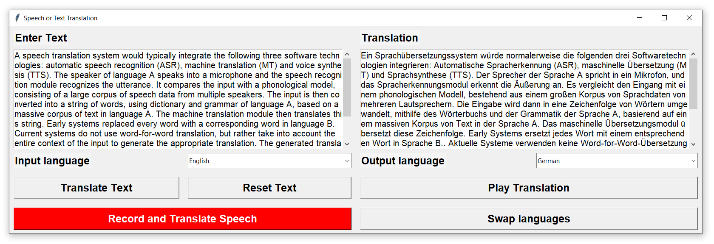

# Speech and Text Translator

Fast speech and text translation with Python's [Speech Recognition](https://pypi.org/project/SpeechRecognition/), [Google Translate](https://pypi.org/project/googletrans/) and [Google Text-to-Speech](https://pypi.org/project/gTTS/) libraries.



**Text-To-Speech, Translator and Speech Recognizer**
```Python
from gtts import gTTS
from google_trans_new import google_translator
import speech_recognition as sr

f = io.BytesIO()
translator = google_translator()
r = sr.Recognizer()
```

**Speech Record**
```Python3
# record speech and forward to translate function    
def Listen():
    global r, translated_text
    with sr.Microphone() as source:
        r.adjust_for_ambient_noise(source)
        audio = r.listen(source)
    Translate(1, audio)
```

**Speech Recognition, Translation and Audio File generation**
```Python
# Translate text, create file-like audio object (stream) f and enable Play Button. 
# Closing stream f (f.close()) before new creation to remove old unplayed stream 
#   bytes (f.flush() did not work)
def Translate(audio_flag, audio=NONE):
    ...
    elif audio_flag == 1:
        try:
            enter_text_field.delete('1.0', END)
            input_text = r.recognize_google(audio, language=in_language)
            enter_text_field.insert('1.0', input_text)
        except sr.UnknownValueError:
            messagebox.showerror("Error", \
                "Google Speech Recognition could not understand what you said. Try again.")
            return
        except sr.RequestError:
            messagebox.showerror("Error", \
                "Could not request results from Google Speech Recognition service. Check internet connection.")
            return
    ...
    translated_text = translator.translate(input_text, out_language, in_language)
    ...
    gTTS(text = translated_text, lang=out_language).write_to_fp(f)
```

**Play Translation Audio**
```Python
# executed by playing_thread
def Play():
    global translation_playing, button_play_translation_or_stop, f
    player = pyglet.media.load('_.mp3', file=f).play()
    translation_playing=TRUE
    button_play_translation_or_stop.config(text='Stop')
    while player.playing:
        if translation_playing==FALSE:
            player.pause()
            player.delete()
            #print(str(threading.get_ident()) + 'B')
            Reset_Play_Button()
            return
        else:
            pyglet.app.platform_event_loop.dispatch_posted_events()
            pyglet.clock.tick()
    translation_playing=FALSE
    Reset_Play_Button()
```
